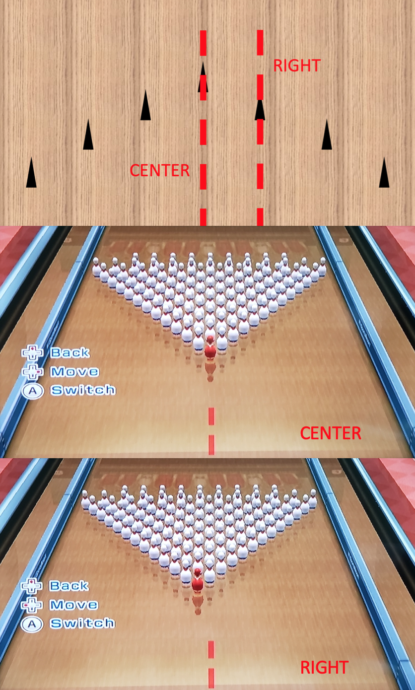
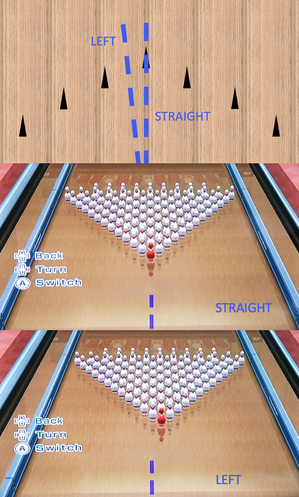
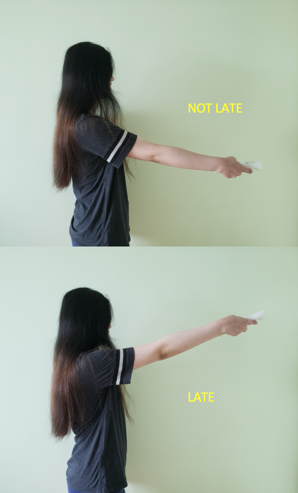

```{r setup, include=FALSE}
knitr::opts_chunk$set(echo = FALSE, warning = FALSE, message = FALSE)
library(knitr)
library(kableExtra)
library("FrF2")
```

# Description

100-pin bowling is a mode of bowling in _Wii Sports Resort_, a video game developed by Nintendo for the Wii gaming system. Like conventional 10-pin bowling, the aim of 100-pin bowling is to knock down all the pins, ideally in a single throw called a strike. According to an [online forum](https://strategywiki.org/wiki/Wii_Sports/Bowling), it was claimed that players should position themselves to the right of the bowling lane, angle themselves slightly to the left, and throw the ball late if they wanted to knock down more pins (StrategyWiki, n.d.). The purpose of this experiment is to test these claims and determine the effects of position, angle, and timing on the number of pins knocked down.

A $2^3$ factorial experiment was conducted to determine the number of pins knocked down using 3 qualitative factors - position, angle, and timing. As shown in Figure \@ref(fig:levels), each factor had 2 levels which include _right_ and _center_, _left_ and _straight_, and _late_ and _not late_ respectively. The experiment had 3 repetitions and a total of 24 runs, which were randomized using R prior to the experiment. During each run, the ball was thrown based on the levels specified by the randomization. Bowling lane arrows were used to improve the consistency of position and angle. Each throw was also done while trying to maintain a consistent motion and speed. After each throw, the number of pins knocked down were recorded. Since each round consists of 2-3 throws, the second and third balls were thrown randomly and the pins knocked down were not recorded. This step replaced all 100 pins with new pins and ensured that each run had an equal probability of a strike. 2.4 games were played until all 24 runs were complete.

```{r levels, fig.cap="Levels of position, angle, and timing", fig.subcap=c("Position", "Angle", "Timing"), fig.ncol=3, out.width=".28\\linewidth", fig.align="center"}



```


# Analysis

```{r}
# Randomize the order of the runs. This was used for the experiment.
set.seed(04082012)
runs <- sample(1:24, size=24, replace=F)

# Read the data
results <- read.csv('100bowling2.csv')

# Build a linear regression model for the data
model <- lm(pins ~ position*angle*timing, data=results,
            contrasts=list(position = "contr.sum",
                           angle = "contr.sum",
                           timing = "contr.sum"))

# Summary of the linear model
lm.summary <- data.frame(
  estimate <- round(summary(model)$coefficients,2)[,1],
  effect <- estimate*2,
  p.val <- round(summary(model)$coefficients,2)[,4],
  lower.ci <- round(2*confint.lm(model,level = 0.90),2)[,1],
  upper.ci <- round(2*confint.lm(model,level = 0.90),2)[,2]
)
```

After data was collected, a linear model was fitted to estimate the main and interaction effects. The model can be written as:
$$
y_i = \beta_0 + \beta_1x_{i1} + \beta_1x_{i2} + \beta_3x_{i3} + \beta_4x_{i1}x_{i2} + \beta_5x_{i1}x_{i3} + \beta_6x_{i2}x_{i3} + \beta_7x_{i1}x_{i2}x_{i3} + \epsilon
$$
where $y_i$ is the number of pins knocked down after the ith run and $x_{i1}$, $x_{i2}$, $x_{i3}$ represent position, angle, and timing respectively. Deviation coding was used such that _right_ position, _left_ angle, and _late_ timing were coded as 1 while _center_ position, _straight_ angle, and _not late_ timing were coded as -1. A summary of the fitted linear model with the estimated effects are shown in Table \@ref(tab:lmtable).

```{r lmtable, out.width=".6\\linewidth"}
# Table summarizing estimates and estimated effects
kable(lm.summary[1:2],
      col.names = c("Estimate", "Estimated Effect"),
      format="latex", booktabs=T, linesep="",
      caption = "Summary of linear model") %>% 
  kable_styling(latex_options = c("striped", "HOLD_position"), stripe_color = "#F5F9FF")
```

As outlined in Table \@ref(tab:lmtable), the mean number of pins that were knocked down for this sample was `r lm.summary[1,1]`. The estimated means for each combination of levels is illustrated in the cube plot in Figure \@ref(fig:cubeplot). Based on this plot, the estimated mean number of pins knocked down is the highest when the ball is thrown with a _right_ position, _straight_ angle, and _late_ timing. It is also the lowest when thrown with a _right_ position, _left_ angle, and _late_ timing.

```{r cubeplot, fig.cap="Cube plot for 100-Pin Bowling Experiment", out.width=".4\\linewidth", fig.align="center"}
cubePlot(model,"position","angle","timing",
         main=NA, cex.clab=1, cex.lab=1.2,
         round=1,abbrev=15,y.margin.add=0.1)
```

In Table \@ref(tab:lmtable), position, angle, and timing had estimated main effects of `r paste(lm.summary[2:3,2], sep = "", collapse = ", ")`, and `r lm.summary[4,2]` respectively. Since the sign of these effects are negative, this means a greater number of pins are knocked down using levels that are coded as -1 rather than 1 on average. In other words, this means the average number of pins knocked down is greater when the ball is thrown using a _center_ position rather than a _right_ position. It is also greater when thrown with a _straight_ angle rather than a _left_ angle. And finally, it is greater when thrown with a _not late_ timing rather than a _late_ timing.

The estimated two-factor interaction effect between position and angle, position and timing, and angle and timing was `r paste(lm.summary[5:6,2], sep = "", collapse = ", ")`, and `r lm.summary[7,2]` respectively. For position and angle, the sign of the interaction effect is negative. This means the average effect of position is greater when a _straight_ angle is used compared to a _left_ angle. Likewise, for the remaining two interactions, the signs are also negative and so the average effect of position and the average effect of angle is greater when a _not late_ timing is used rather than a _late_ timing. As shown in Figure \@ref(fig:intplots), the lines in plot (a) and (b) do not intersect while the lines in plot (c) do. This means there there may be an interaction between angle and timing, but no interaction between position and angle or position and timing. This can be seen from the estimated interaction effects in Table \@ref(tab:lmtable) since the magnitude of the effect between angle and timing is large (`r abs(lm.summary[7,2])`) compared the magnitude for the remaining two interactions which are quite small (`r abs(lm.summary[5,2])` for position and angle; `r abs(lm.summary[6,2])` for position and timing).

The estimated three-factor interaction effect between position, angle, and timing was `r lm.summary[8,2]` as shown earlier in Table \@ref(tab:lmtable). Since it is negative, this means the two-factor interaction between position and angle is greater when a _not late_ timing is applied compared to a _late_ timing.

```{r intplots, fig.cap="Interaction plots", fig.subcap=c("Position and angle", "Position and timing", "Timing and angle"), out.width=".33\\linewidth", fig.align="center" }
# Interaction plot for position and angle
interaction.plot(results$position,results$angle,results$pins, type = "l",
                 xlab = "Position",trace.label = "Angle",
                 ylab = "Pins")
# Interaction plot for position and timing
interaction.plot(results$position,results$timing,results$pins, type = "l",
                 xlab = "Position",trace.label = "Timing",
                 ylab = "Pins")
# Interaction plot for angle and timing
interaction.plot(results$angle,results$timing,results$pins, type = "l",
                 xlab = "Timing",trace.label = "Angle",
                 ylab = "Pins")
```

After the effects were analyzed, hypothesis tests at 10% significance level were performed to check which effects were most likely real and which were due to chance. The hypothesis tests were defined with
$$
\begin{aligned}
H_0:& \beta_j = 0 \\
H_1:& \beta_j \not= 0
\end{aligned}
$$  
for $j=1,...,7$. Table \@ref(tab:lmtable2) summarizes the p-values and 90% confidence intervals for each of the estimates.

```{r lmtable2, out.width=".6\\linewidth"}
# Table for hypothesis testing
kable(lm.summary[3:5],
      col.names = c("P-value", "90% CI Lower Bound", "90% CI Upper Bound"),
      format="latex", booktabs=T, linesep="",
      caption = "Hypothesis tests for main and interaction effects") %>% 
  kable_styling(latex_options = c("striped", "HOLD_position"), stripe_color = "#F5F9FF")
```

Based on the table, the interaction effect between angle and timing is the only effect that is likely real and not due to chance. The reason for this is because its associated p-value is less than the 10% significance level and its confidence interval does not contain 0. Thus, $H_0$ was rejected and so there is evidence that the effect is not due to chance. All the main effects and the remaining interaction effects have p-values that are larger than the 10% significance level and confidence intervals that contain 0. Therefore, $H_0$ was not rejected and so the effects could have been due to chance.


# Conclusions and Discussions

Based on the linear model, the estimated main effects and interaction effects suggested that using _center_ position, _straight_ angle, and _not late_ timing was more effective in knocking down more pins compared to using _right_ position, _left_ angle, and _late_ timing. However, hypothesis testing showed that these effects could have been due to chance, except for the interaction between angle and timing which had statistical evidence that indicated a greater average effect on angle with a _not late_ timing rather than a _late_ timing. Thus, there is no statistical evidence that using a _right_ position, _left_ angle, and _late_ timing will increase the average number of pins a player knocks down and so the claims made on the [online forum](https://strategywiki.org/wiki/Wii_Sports/Bowling) may not be true.

Nevertheless, the results in this study should be carefully interpreted because various sources of error do exist. Firstly, there may have been inconsistencies with maintaining consistency for each of the factors. While bowling lane arrows were used to keep position and angle consistent, a possibility of minor inconsistencies still remains. For timing, a _late_ timing (or _not late_ timing) was thrown based on personal judgment during each throw. This judgment could differ each time and so there were no measures taken to keep this consistent. These inconsistencies could bias the results. Secondly, there may have also been inconsistencies with maintaining motion and speed for each throw. Inconsistent motions may cause the ball to curve and hit the pins differently compared to a throw without curve. Inconsistent speed may create more or less power to knock down the pins. Thus, these factors may have also biased the results. Lastly, the study only involved data from one individual. The results could be biased since sample may not represent the entire population of people who play 100-pin bowling. For example, the sampled individual has over 10 years of experience with playing 100-pin bowling and has achieved all the in-game achievements associated with it. This may not represent the amount of experience and skill that a typical player has and so the claims on the forum might have been true for the general population, but not the individual. Hence, the results of this study could have been biased and may only be applicable to the sampled individual.

For future studies, it is recommended that more measures are taken to ensure consistencies with the 3 factors, motion, and speed. It is also suggested for the data should be sampled from a greater number of individuals. Doing so would will help to improve generalizability and reduce bias so that better analyses could be performed to estimate the true effects of position, angle, and timing in knocking down pins in 100-pin bowling.


# Reference
StrategyWiki. (n.d.). Wii Sports/Bowling — StrategyWiki, the video game walkthrough and strategy guide wiki. Retrieved August 18, 2020, from https://strategywiki.org/wiki/Wii_Sports/Bowling


